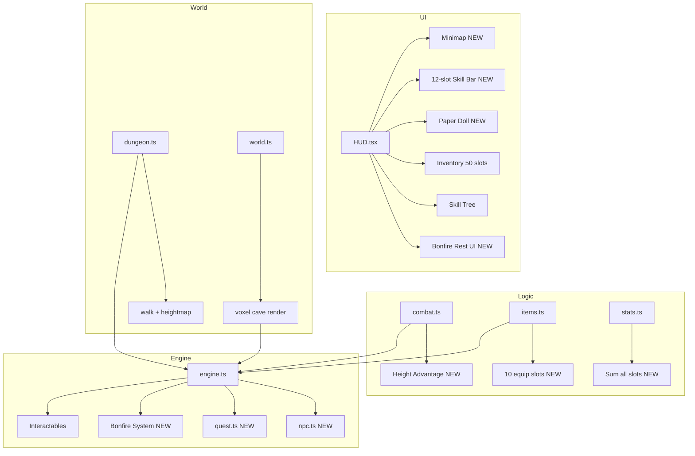
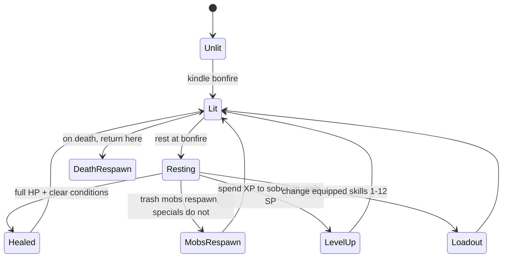

# Full Game Redesign — Architecture Plan

> **Vision:** A BG3-clone dungeon crawler with Dark Souls bonfire mechanics,
> Dungeon Crawler Carl tone. Voxel art (C=0.055). Turn-based combat with
> verticality, a full BG3-style HUD (minimap, 12-slot skill bar, 50-slot
> inventory, paper doll), bonfire rest/respawn/leveling, and a hand-crafted
> voxel cave dungeon with an old hermit NPC + quest.

---

## Current System State

| System | File | Current state | What needs to change |
|---|---|---|---|
| **HUD** | [`HUD.tsx`](src/components/HUD.tsx) | Party frames, 4-slot hotbar (combat only), combat log, inventory/skill-tree toggles | Add minimap, permanent 12-slot skill bar, paper doll, rest/level UI at bonfire |
| **Inventory** | [`InventoryPanel.tsx`](src/components/InventoryPanel.tsx) | 3 equip slots (weapon/armor/trinket), unlimited bag | Full paper doll (head/chest/legs/boots/gloves/weapon/off-hand/amulet/ring1/ring2), 50-slot bag cap |
| **Skill tree** | [`SkillTreePanel.tsx`](src/components/SkillTreePanel.tsx) | Per-class 2-branch × 3-tier tree, max 4 equipped skills | Expand to 12 equipped slots, accessible only at bonfire |
| **Types** | [`types.ts`](src/game/types.ts) | `Unit` has `equippedSkills: string[]` (max 4), `equipment` has 3 slots | Expand `equipment` to full paper doll, `equippedSkills` to 12, add `restedAtBonfire` |
| **Items** | [`items.ts`](src/game/items.ts) | 3 equip slots, no slot-specific armor | Add slot-specific items (boots, gloves, helmet, etc.) |
| **Dungeon** | [`dungeon.ts`](src/levels/dungeon.ts) | Flat-floor cave, no verticality, no NPC | Full cave with stairs/mezzanines, hermit NPC, hidden treasures |
| **World** | [`world.ts`](src/game/world.ts) | Flat height=1 when layout present | Render heightmap (stairs/mezzanines) |
| **Combat** | [`combat.ts`](src/game/combat.ts) | No height advantage | Add high-ground modifier |
| **Bonfire** | engine.ts | Lights a checkpoint, no rest/respawn-mobs/level | Add rest (heal + respawn trash mobs), level-up (sober up), skill loadout change |
| **NPC/Quest** | — (none) | — | New `npc.ts` + `quest.ts` |

---

## Phase Breakdown (compile after each phase)

### Phase 1 — Dungeon cave layout + heightmap rendering
**Files:** `dungeon.ts`, `levelTypes.ts`, `world.ts`, `dungeonGen.ts`
0. redesign the full dungeon from scratch walls, ramps, etc, using voxel c=0.055.
1. Extend `LevelStructures` with: `hermit`, `hermitChamber`, `hiddenTreasures`, `mezzanines`, `stairs`, `collapsedDeadEnds`.
2. Rewrite `buildDungeon()` for a richer cave:
   - Wider hallways (bore 1.5–2.0), larger blob chambers, collapsed dead-ends (rubble blockages).
   - Stairs + mezzanines via `buildTerrain`'s `floorSteps`/`stepSize`.
   - Hermit chamber near spawn (single entrance).
   - Hidden treasures in dead-ends.
   - Redesigned boss room (larger natural cave, raised ledge, destructibles).
3. Switch `world.ts` to render the heightmap (not flat height=1) + voxel rock-wall skirting.

**Compile gate:** `npx tsc --noEmit` + `npx vite build`.

### Phase 2 — Hermit NPC + dialogue + quest
**Files:** `npc.ts` (new), `quest.ts` (new), `types.ts`, `items.ts`, `engine.ts`

1. Types: `NPCDef`, `QuestDef`, `QuestState`.
2. Quest items: `severed_finger`, `stupid_shirt`, `toeless_boots`.
3. **Old Merv the hermit** — quest: kill "Baron Gnaw" (a named rat), loot the finger, return it for the toeless boots.
4. Build hermit rig, click-to-talk, dialogue overlay, quest state machine.

**Compile gate:** `npx tsc --noEmit` + `npx vite build`.

### Phase 3 — Height advantage + encounter polish
**Files:** `combat.ts`, `engine.ts`, `dungeon.ts`

1. Height-advantage modifier (attacker higher → +2 atk; lower → -2 atk).
2. Ranged-mob encounter on a mezzanine.
3. Hidden treasure proximity reveal.
4. Boss cutscene framing for the new room.

**Compile gate:** `npx tsc --noEmit` + `npx vite build`.

### Phase 4 — Paper doll + expanded equipment slots
**Files:** `types.ts`, `items.ts`, `InventoryPanel.tsx`, `engine.ts`, `stats.ts`

1. Expand `Unit.equipment` to: `head, chest, legs, boots, gloves, weapon, offHand, amulet, ring1, ring2`.
2. Add slot-specific items to `items.ts` (boots, gloves, helmet, shield off-hand, etc.).
3. Redesign `InventoryPanel.tsx` as a full paper doll (left) + 50-slot bag grid (right).
4. Update `stats.ts` to sum AC/bonuses from all slots.
5. Update engine equip/unequip for all slots.

**Compile gate:** `npx tsc --noEmit` + `npx vite build`.

### Phase 5 — BG3-style HUD: minimap + permanent 12-slot skill bar
**Files:** `HUD.tsx`, `types.ts`, `engine.ts`, `index.css`

1. **Minimap** (top-right corner): a canvas rendering the walkable tiles + party/enemy positions, updating in real time.
2. **Permanent skill bar** (bottom center, always visible — not combat-only):
   - 12 non-default action slots + default actions (basic attack, end turn, etc.).
   - Drag-and-drop or click-to-assign from the skill tree.
   - Keys 1-9, 0, -, = for the 12 slots.
3. Expand `Unit.equippedSkills` from 4 → 12.
4. Update the skill tree panel to allow assigning up to 12 skills.
5. CSS overhaul for the BG3 dark-glass aesthetic.

**Compile gate:** `npx tsc --noEmit` + `npx vite build`.

### Phase 6 — Bonfire mechanics (Dark Souls style)
**Files:** `engine.ts`, `types.ts`, `combat.ts`, `dungeon.ts`

1. **Rest at bonfire:**
   - Fully restores HP and conditions.
   - Respawns all trash mobs (not bosses, not special mobs like the hermit or Baron Gnaw).
   - Is the **only place** you can level up (sober up) and change your skill loadout.
2. **Leveling = sobering up:** spending XP at a bonfire increases level, grants skill points, and the narrator comments on Greg getting marginally less drunk.
3. **Respawn on death:** return to last bonfire, keep gold/loot/levels, lose positional progress (trash mobs respawn).
4. Track `restedBonfires: Set<GridPos>` and `defeatedSpecialMobs: Set<string>` so special mobs don't respawn.

**Compile gate:** `npx tsc --noEmit` + `npx vite build`.

---

## System Architecture (Mermaid)



## Bonfire Flow (Mermaid)



## Paper Doll Layout

```
 ┌─────────────────────────┐
 │  HEAD    [    ]         │
 │  CHEST   [    ]         │
 │  LEGS    [    ]         │
 │  BOOTS   [    ]         │
 │  GLOVES  [    ]         │
 │  WEAPON  [    ]         │
 │  OFFHAND [    ]         │
 │  AMULET  [    ]         │
 │  RING1   [    ]         │
 │  RING2   [    ]         │
 └─────────────────────────┘
```

## Skill Bar Layout (BG3 style)

```
 [⚔] [1] [2] [3] [4] [5] [6] [7] [8] [9] [0] [=] [⏎]
  ^default attack                          ^12 slots ^end turn
```

---

## Risk Mitigation
- **Compile after every phase** (user's explicit instruction).
- Phase 1 (heightmap render) is riskiest — fallback to flat floor + visual mezzanine meshes.
- Phase 4 (paper doll) touches `stats.ts` — must re-sum all slots or AC breaks.
- Phase 5 (minimap) is self-contained (a canvas overlay reading world data).
- Phase 6 (bonfire) is engine logic — must carefully track which mobs respawn.
